# 📸 RENTCAM — Modern Camera & Drone Rental System

[](https://www.php.net/)
[](https://codeigniter.com/)
[](https://www.mysql.com/)
[](https://www.docker.com/)

**RENTCAM** adalah platform penyewaan kamera dan drone berbasis web yang dirancang dengan antarmuka modern, intuitif, dan responsif. Sistem ini mencakup manajemen inventaris, sistem booking real-time dengan proteksi concurrency, hingga dashboard analitik untuk pemantauan bisnis yang komprehensif.

Aplikasi ini dikembangkan sebagai proyek mata kuliah Rekayasa Perangkat Lunak (Semester 4) dengan fokus pada performa, keamanan, dan keandalan data finansial.

---

## 👥 Tim Pengembang (Kelompok)

| Nama | NIM | Kelas | Peran / Fokus |
|---|---|---|---|
| **Haidar Habibi Al Farisi** | 240202862 | 4IKRB | Lead Developer & Backend Engine |
| **Ismi Nur Fadilah** | 240202868 | 4IKRB | Frontend Designer & UI/UX |
| **Fauzatul Farhanah** | 240202834 | 4IKRB | System Analyst & Database Designer |
| **Tyas Nurshika Damaia** | 240202887 | 4IKRB | Quality Assurance & Documentation |

---

## 🚀 Tech Stack & Spesifikasi Sistem

### Backend & Core
* **PHP 7.4/8.0** menggunakan framework **CodeIgniter 3.1.13 (MVC)**.
* **MySQL/MariaDB** sebagai basis data relasional.
* **Apache HTTP Server** (Containerized).

### Frontend (Modern UI)
* **HTML5** & **Vanilla CSS3** dengan pendekatan *Custom CSS Variables* (Tanpa CSS framework berat, menjamin kecepatan load time).
* **JavaScript (ES6)** untuk interaksi dinamis dan handling AJAX.
* **Chart.js**: Visualisasi data analitik pendapatan dan tren penyewaan.
* **SweetAlert2**: Alert box, dialog konfirmasi hapus, dan notifikasi premium yang interaktif.
* **AOS (Animate On Scroll)**: Efek transisi elemen yang mulus saat scrolling.
* **FontAwesome 5**: Ikonografi modern dan konsisten.

---

## 🛡️ Fitur Canggih & Solusi Arsitektur (Enterprise Grade)

Untuk memenuhi standar keamanan dan integritas data industri, sistem RENTCAM dilengkapi dengan mekanisme berikut:

### 1. Concurrency Control (Pessimistic Locking)
* **Masalah**: Jika sisa stok kamera tinggal `1`, lalu dua pengguna melakukan klik "Booking" secara bersamaan (Race Condition), sistem konvensional dapat kebobolan mencatat kedua booking tersebut dan membuat stok menjadi minus (`-1`).
* **Solusi**: RENTCAM menggunakan **Pessimistic Locking (`SELECT ... FOR UPDATE`)** yang dibungkus dalam **Database Transaction** (`trans_start()` dan `trans_complete()`). Selama proses pengecekan stok dan pembuatan booking berlangsung, baris data produk dikunci rapat di tingkat database sehingga request kedua harus mengantre hingga request pertama selesai.

### 2. Financial Integrity (Soft Delete)
* **Masalah**: Menghapus data transaksi sewa secara permanen (*Hard Delete*) akan merusak laporan kas tahunan Super Admin karena total pendapatan di sistem tidak akan pernah balance dengan uang fisik di rekening bank/kasir.
* **Solusi**: Penerapan **Soft Delete** dengan menambahkan kolom `deleted_at`. Data booking yang "dihapus" oleh user/admin sebenarnya tetap tersimpan utuh di database untuk keperluan pembukuan keuangan dan audit, namun disembunyikan dari antarmuka pengguna melalui filter query `WHERE deleted_at IS NULL`.

---

## 📋 Struktur Hak Akses & Alur Bisnis

```mermaid
graph TD
    A[RENTCAM Platform] --> B(Guest / Pengunjung)
    A --> C(Member / Penyewa)
    A --> D(Administrator)
    A --> E(Super Admin)

    subgraph Akses Publik
    B --> B1[Jelajah Katalog Produk]
    B --> B2[Cek Spesifikasi & Stok]
    end

    subgraph Akses Penyewa
    C --> C1[Booking Online & Lock Stok]
    C --> C2[Upload Bukti Pembayaran]
    C --> C3[Manajemen Profile & Pesanan]
    C --> C4[Ulas & Beri Rating Produk]
    C --> C5[Batalkan Booking / Soft Delete]
    end

    subgraph Akses Admin
    D --> D1[Kelola Inventaris CRUD]
    D --> D2[Verifikasi Pembayaran Member]
    D --> D3[Update Status Sewa / Pengembalian]
    end

    subgraph Akses Super Admin
    E --> E1[Semua Fitur Admin]
    E --> E2[Dashboard Analitik & Tren Pendapatan]
    E --> E3[Manajemen Akun Staff Admin/User]
    E --> E4[Laporan Keuangan & Audit Transaksi]
    end
```



---

## 📂 Project Structure

```text
rentcam/
├── application/          # Inti aplikasi (MVC)
│   ├── config/           # Pengaturan database, routes, & autoload
│   ├── controllers/      # Logika aplikasi (Admin, Superadmin, Auth, dll)
│   ├── models/           # Interaksi database
│   └── views/            # Template UI (Premium layouts)
├── assets/               # File statis
│   ├── css/              # Stylesheet global (Modern Design System)
│   ├── js/               # Logika frontend
│   └── uploads/          # Direktori foto produk & bukti bayar
├── .env                  # Konfigurasi environment (Private)
├── .dockerignore         # File pengecualian build Docker
├── docker-compose.yml    # Orkestrasi container (PHP & MySQL)
├── Dockerfile            # Blueprint environment PHP/Apache
├── DOCKER_SETUP.md       # Dokumentasi & panduan teknis Docker
└── index.php             # Entry point aplikasi
```

---

## ⚙️ Panduan Instalasi Menggunakan Docker

Dengan menggunakan Docker, Anda tidak perlu menginstal XAMPP, PHP, atau MySQL secara lokal di komputer Anda. Containerisasi memastikan aplikasi berjalan di lingkungan yang identik di semua komputer tim.

### 1. Persyaratan Awal
Pastikan Anda sudah mengunduh dan menjalankan [Docker Desktop](https://www.docker.com/products/docker-desktop).

### 2. Kloning & Jalankan Container
Buka terminal (Command Prompt/PowerShell di Windows atau Terminal di macOS/Linux), kemudian jalankan perintah berikut:

```bash
# 1. Masuk ke direktori proyek
cd "path/to/rentcam"

# 2. Salin konfigurasi env (jika belum ada)
cp .env.example .env

# 3. Jalankan container di background (build otomatis jika pertama kali)
docker-compose up -d
```

### 3. Akses Aplikasi
- **Web App**: `http://localhost/`
- **PHPMyAdmin**: `http://localhost:8081/` (User: `rentcam`, Pass: `password`)

*(Database MySQL akan secara otomatis dibuat dan diinisialisasi berdasarkan skema dari file `rentcam.sql` jika diletakkan di direktori `sql/`.)*

Untuk dokumentasi Docker yang lebih lengkap (troubleshooting, config `.env`, dll), silakan merujuk ke file [DOCKER_SETUP.md](DOCKER_SETUP.md).

---

## 🔐 Akun Akses Default (Untuk Pengujian)

Gunakan akun-akun di bawah ini untuk mencoba berbagai level hak akses di sistem RENTCAM:

| Role / Tingkat Akses | Alamat Email | Kata Sandi | Deskripsi Hak Akses |
|---|---|---|---|
| **Super Admin** | `superadmin@gmail.com` | `superadmin123` | Akses penuh dashboard finansial, analitik, dan manajemen staff. |
| **Admin** | `admin@gmail.com` | `admin1234` | Manajemen inventaris kamera/drone, validasi pembayaran, dan status sewa. |
| **Member / User** | `user@gmail.com` | `user123` | Melakukan pemesanan barang, mengunggah bukti bayar, dan memberi ulasan. |

---

## 🖼️ Tampilan Antarmuka Aplikasi

Berikut adalah pratinjau halaman beranda utama dari platform RENTCAM:


---
*Proyek ini dilindungi oleh hak cipta kelompok pengembang dan ditujukan untuk pemenuhan tugas akademik semester 4.*


