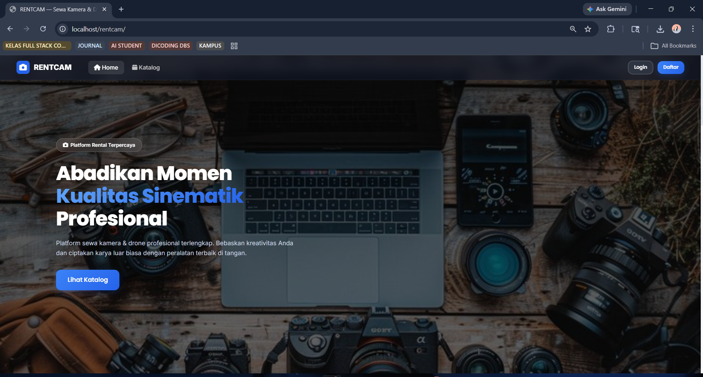

# 📸 RENTCAM — Camera & Drone Rental System

## 👥 Tim Pengembang (Kelompok)

| Nama | NIM | Kelas |
|---|---|---|
| Nama Anggota 1 | NIM_ANDA_1 | KELAS_ANDA |
| Nama Anggota 2 | NIM_ANDA_2 | KELAS_ANDA |
| Nama Anggota 3 | NIM_ANDA_3 | KELAS_ANDA |
| Nama Anggota 4 | NIM_ANDA_4 | KELAS_ANDA |

## 🚀 Tech Stack

- **Backend**: PHP (CodeIgniter 3)
- **Database**: MySQL / MariaDB (via XAMPP)
- **Frontend**: HTML, CSS, JavaScript (Vanilla / Bootstrap)
- **Design Pattern**: MVC (Model-View-Controller)

## 📋 Fitur Utama

- **Pengunjung (Guest)**: Menjelajahi katalog produk, melihat detail spesifikasi, dan cek harga sewa.
- **Penyewa (User/Member)**: Booking online real-time, riwayat penyewaan, upload bukti pembayaran, dan manajemen profil.
- **Administrator**: Verifikasi pembayaran, manajemen stok alat, update status penyewaan (dipinjam/kembali), dan CRUD data produk.
- **Super Admin**: Dashboard laporan pendapatan, manajemen akun (Admin & User), serta kendali penuh konfigurasi sistem.

## ⚙️ Installation & Setup

Follow these steps to get the project running locally:

### 1. Prerequisites
- [XAMPP](https://www.apachefriends.org/index.html) (PHP >= 7.4 & MySQL)
- Web Browser

### 2. Clone the Repository
```bash
git clone <repository-url>
cd rentcam
```

### 3. Configuration
- Copy `.env.example` to `.env`.
- Open `application/config/database.php` and ensure the driver is set to `mysqli`.
- Update your database credentials in the `.env` file (Default XAMPP: root / no password).

### 4. Database Setup
- Open **phpMyAdmin** (`http://localhost/phpmyadmin`).
- Create a new database named `rentcam`.


### 5. Running the Application
- Open XAMPP Control Panel and start **Apache** and **MySQL**.
- Place the project folder in `C:\xampp\htdocs\rentcam`.
- Access the application via:
  ```
  http://localhost/rentcam
  ```

## 📂 Project Structure

```text
rentcam/
├── application/          # Core logic (MVC)
│   ├── config/           # Database & App settings
│   ├── controllers/      # Route handlers
│   ├── models/           # Database interactions
│   └── views/            # UI Templates
├── assets/               # Static files
│   ├── css/              # Stylesheets
│   └── uploads/          # User-uploaded images
├── system/               # CodeIgniter 3 Core
├── .env                  # Environment configuration
├── .gitignore            # Git ignore rules
└── index.php             # Application entry point
```

- `application/`: Contains the main source code of the application following the MVC pattern.
- `assets/`: Stores all frontend assets such as CSS, Javascript, and user uploads.
- `system/`: The core framework files of CodeIgniter 3.
- `.env`: Configuration file for environment-specific variables like database credentials.
## 🔐 Credentials (Default)

Berikut adalah kredensial untuk login ke sistem:

### Super Admin
- **Email**: `[EMAIL_ADDRESS]`
- **Password**: `admin123`

### User
- **Email**: `[EMAIL_ADDRESS]`
- **Password**: `user123`

### Admin
- **Email**: `admin1@gmail.com`
- **Password**: `admin1234`

## 🖼️ UI Preview

Berikut adalah tampilan antarmuka utama dari platform RENTCAM:



## 🤝 Contributing

1. Fork the Project
2. Create your Feature Branch (`git checkout -b feature/AmazingFeature`)
3. Commit your Changes (`git commit -m 'Add some AmazingFeature'`)
4. Push to the Branch (`git push origin feature/AmazingFeature`)
5. Open a Pull Request

---


