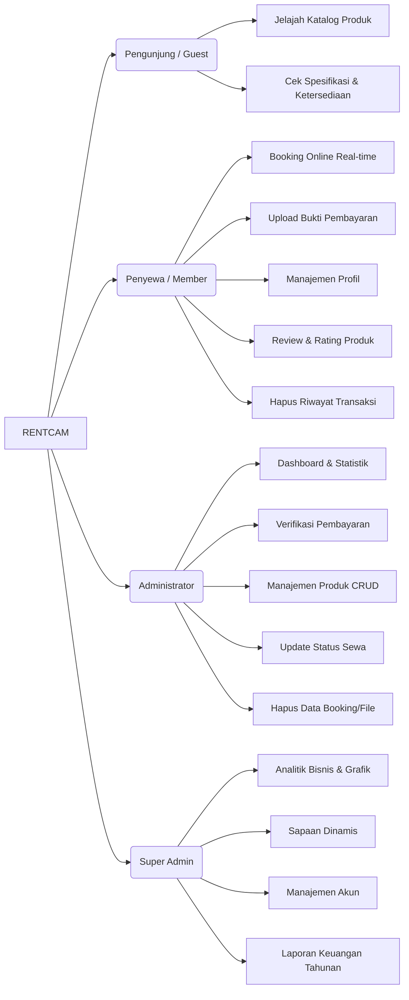

# 📸 RENTCAM — Modern Camera & Drone Rental System

RENTCAM adalah platform penyewaan kamera dan drone berbasis web yang dirancang dengan antarmuka modern, intuitif, dan responsif. Sistem ini mencakup manajemen inventaris, sistem booking real-time, hingga dashboard analitik untuk pemantauan bisnis yang komprehensif.

## 👥 Tim Pengembang (Kelompok)

| Nama | NIM | Kelas |
|---|---|---|
| Haidar Habibi Al Farisi | 240202862 | 4IKRB |
| Ismi Nur Fadilah | 240202868 | 4IKRB |
| Fauzatul Farhanah | 240202834 | 4IKRB |
| Tyas Nurshika Damaia | 240202887 | 4IKRB |

## 🚀 Tech Stack

- **Backend**: PHP (CodeIgniter 3)
- **Database**: MySQL / MariaDB
- **Frontend**: HTML5, Vanilla CSS3 (Modern UI), JavaScript (ES6)
- **Library & Assets**:
    - **Chart.js**: Untuk visualisasi data pendapatan dan transaksi.
    - **FontAwesome 5**: Untuk ikonografi yang informatif.
    - **SweetAlert2**: Untuk popup konfirmasi dan notifikasi premium.
    - **AOS (Animate On Scroll)**: Untuk animasi transisi halaman yang halus.
    - **Google Fonts**: Poppins (Heading) & Inter (Body).

## 📋 Fitur Utama



## ⚙️ Installation & Setup (Docker)

Karena aplikasi ini menggunakan Docker, Anda tidak perlu menginstal XAMPP. Cukup pastikan Docker sudah terpasang di sistem Anda.

### 1. Prerequisites
- [Docker Desktop](https://www.docker.com/products/docker-desktop)
- Docker Compose (sudah terintegrasi dengan Docker Desktop)

### 2. Clone & Build
```bash
# Clone repository
git clone <repository-url>
cd rentcam

# Jalankan container (Build otomatis jika belum ada image)
docker-compose up -d
```

### 3. Akses Aplikasi
- **Web App**: `http://localhost/`
- **PHPMyAdmin**: `http://localhost:8081/` (User: `rentcam`, Pass: `password`)

*(Database MySQL akan secara otomatis dibuat dan diinisialisasi berdasarkan skema dari file `rentcam.sql` jika diletakkan di direktori `sql/`.)*

Untuk dokumentasi Docker yang lebih lengkap (troubleshooting, config `.env`, dll), silakan merujuk ke file [DOCKER_SETUP.md](DOCKER_SETUP.md).

## 📂 Project Structure

```text
rentcam/
├── application/          # Inti aplikasi (MVC)
│   ├── config/           # Pengaturan database, routes, & autoload
│   ├── controllers/      # Logika aplikasi (Admin, Superadmin, Auth, dll)
│   ├── models/           # Interaksi database
│   └── views/            # Template UI (Premium layouts)
├── assets/               # File statis
│   ├── css/              # Stylesheet global (Modern Design System)
│   ├── js/               # Logika frontend
│   └── uploads/          # Direktori foto produk & bukti bayar
├── .env                  # Konfigurasi environment (Private)
├── .dockerignore         # File pengecualian build Docker
├── docker-compose.yml    # Orkestrasi container (PHP & MySQL)
├── Dockerfile            # Blueprint environment PHP/Apache
├── DOCKER_SETUP.md       # Dokumentasi & panduan teknis Docker
└── index.php             # Entry point aplikasi
```

## 🔐 Credentials (Default)

| Role | Email | Password |
|---|---|---|
| **Super Admin** | `superadmin@gmail.com` | `superadmin123` |
| **Admin** | `admin@gmail.com` | `admin1234` |
| **Member** | `user@gmail.com` | `user123` |

## 🖼️ UI Preview

Berikut adalah tampilan antarmuka utama dari platform RENTCAM:


---

