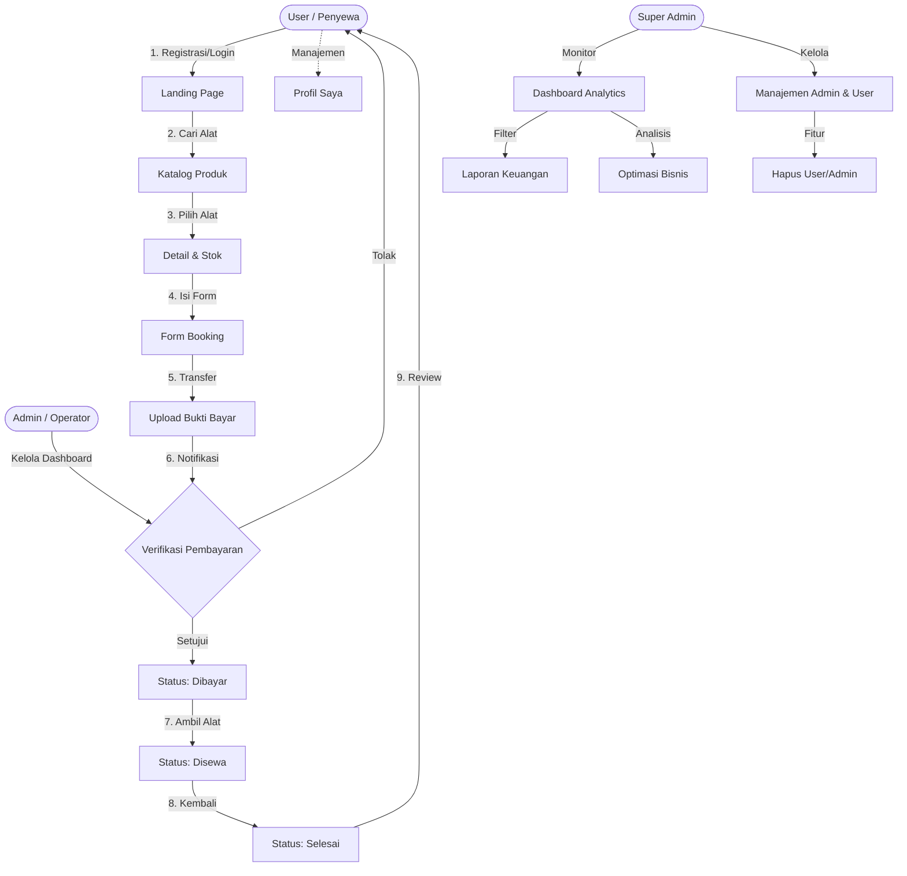

# 📸 RENTCAM — Alur Kerja Sistem (System Workflow)

Dokumen ini menjelaskan bagaimana sistem **RENTCAM** berjalan secara operasional dari sisi **User (Penyewa)**, **Admin (Operator)**, hingga **Super Admin (Manajer)**.

## 🔄 Flowchart Bisnis

---

## 👥 Peran & Tanggung Jawab

### 1. User (Penyewa)
*   **Registrasi & Autentikasi**: Membuat akun untuk mengakses fitur booking.
*   **Manajemen Profil**: Mengubah data diri, email, dan password melalui halaman **Profil Saya**.
*   **Eksplorasi**: Mencari kamera atau drone berdasarkan kategori (Camera/Drone) dan ketersediaan stok.
*   **Booking**: Menentukan durasi sewa. Sistem akan otomatis menghitung total harga berdasarkan tarif per hari.
*   **Transaksi**: Mengunggah bukti transfer bank. Status transaksi akan berubah menjadi "Menunggu Verifikasi".
*   **Feedback**: Memberikan rating dan ulasan setelah transaksi berstatus "Selesai".

### 2. Admin (Operator)
*   **Dashboard Operasional**: Memantau statistik booking harian, pembayaran pending, dan peringatan stok rendah.
*   **Inventory Control**: Manajemen produk (CRUD), upload foto alat, dan pengaturan status (Tersedia/Tidak Tersedia).
*   **Verifikasi**: Meninjau bukti transfer. Admin dapat menyetujui atau menolak pembayaran berdasarkan validitas bukti.
*   **Siklus Sewa**: Memperbarui tahapan sewa secara manual dari "Dibayar" (diambil) menjadi "Disewa", lalu menjadi "Selesai" (dikembalikan).
*   **Stock Management**: Stok alat akan berkurang otomatis saat booking disetujui dan bertambah kembali saat alat dikembalikan.

### 3. Super Admin (Manajemen)
*   **Business Intelligence**: Dashboard analitik dengan grafik Chart.js untuk memantau pendapatan bulanan dan tren produk terlaris.
*   **Greeting Banner**: Dashboard personal dengan sapaan dinamis sesuai waktu login (Pagi/Siang/Sore/Malam).
*   **Account Control**: 
    *   **Kelola Admin**: Menambah atau menghapus akun Admin operasional.
    *   **Manajemen User**: Mengaktifkan/menonaktifkan (suspend) user atau menghapus akun secara permanen.
*   **Financial Reporting**: Akses ke laporan keuangan tahunan dengan filter tahun untuk audit pendapatan bisnis.

---

## 🛠️ Status Transaksi

Sistem menggunakan *state management* untuk melacak setiap tahapan sewa:
1.  **Pending**: Tahap awal setelah booking. Menunggu user mengunggah bukti bayar.
2.  **Confirmed (Dibayar)**: Pembayaran telah diverifikasi admin. Alat siap diambil oleh penyewa.
3.  **Dipinjam (InProgress)**: Alat sudah berada di tangan penyewa. Masa sewa sedang berjalan.
4.  **Kembali (Selesai)**: Alat sudah dikembalikan dalam kondisi baik. Transaksi ditutup.
5.  **Batal (Cancelled)**: Transaksi dibatalkan sebelum proses verifikasi atau karena bukti tidak valid.

---

