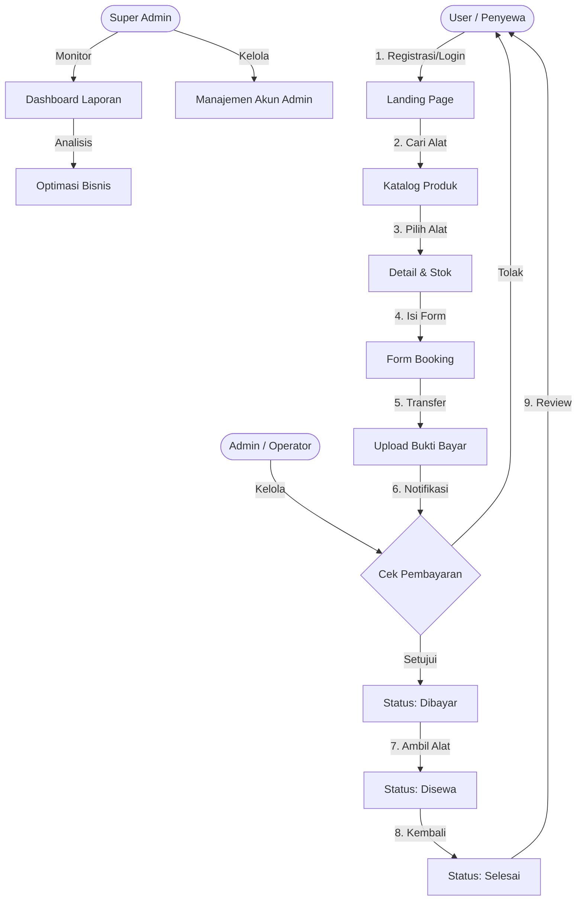

# 📸 RENTCAM — Alur Kerja Sistem (System Workflow)

Dokumen ini menjelaskan bagaimana sistem **RENTCAM** berjalan secara operasional dari sisi **User (Penyewa)**, **Admin (Operator)**, hingga **Super Admin (Manajer)**.

## 🔄 Flowchart Bisnis

---

## 👥 Peran & Tanggung Jawab

### 1. User (Penyewa)
*   **Registrasi & Autentikasi**: Membuat akun dan mengelola profil pribadi.
*   **Eksplorasi**: Mencari kamera atau drone berdasarkan kategori dan ketersediaan stok.
*   **Booking**: Menentukan durasi sewa dan jumlah unit.
*   **Transaksi**: Mengunggah bukti transfer bank untuk diverifikasi.
*   **Feedback**: Memberikan rating dan ulasan setelah masa sewa berakhir.

### 2. Admin (Operator)
*   **Inventory Control**: Menambah, mengubah, atau menonaktifkan produk di katalog.
*   **Verifikasi**: Memvalidasi bukti transfer yang diunggah oleh user.
*   **Operasional**: Mengubah status transaksi dari "Menunggu" -> "Dibayar" -> "Disewa" -> "Selesai".
*   **Stock Management**: Sistem secara otomatis mengurangi stok saat booking divalidasi dan mengembalikannya saat transaksi selesai.

### 3. Super Admin (Manajemen)
*   **Overview**: Memantau grafik pendapatan dan statistik produk paling laris.
*   **Account Management**: Menambah atau menghapus akun Admin operasional.
*   **Reporting**: Mengunduh atau melihat laporan transaksi secara keseluruhan untuk kebutuhan audit.

---

## 🛠️ Status Transaksi
Sistem menggunakan *state management* untuk melacak setiap tahapan sewa:
1.  **Pending**: User sudah booking, tapi belum bayar/upload bukti.
2.  **Menunggu Verifikasi**: Bukti sudah diunggah, menunggu persetujuan Admin.
3.  **Dibayar**: Pembayaran sah, alat siap diambil.
4.  **Disewa**: Alat sedang di tangan user (Masa sewa aktif).
5.  **Selesai**: Alat sudah kembali, transaksi ditutup.
6.  **Dibatalkan**: Transaksi dibatalkan oleh user atau admin.
