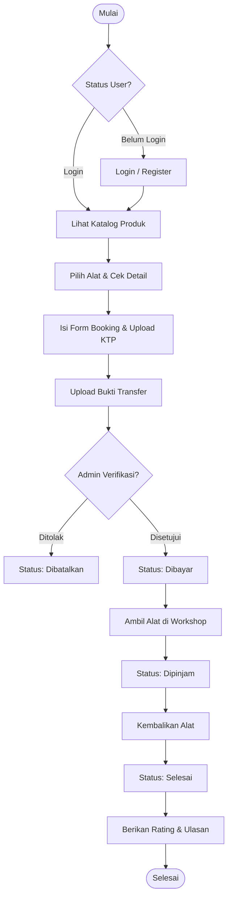
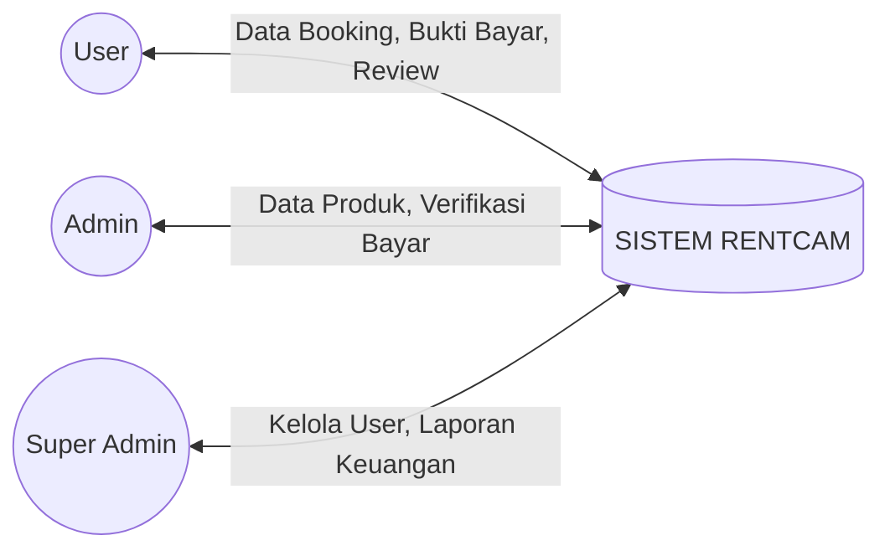
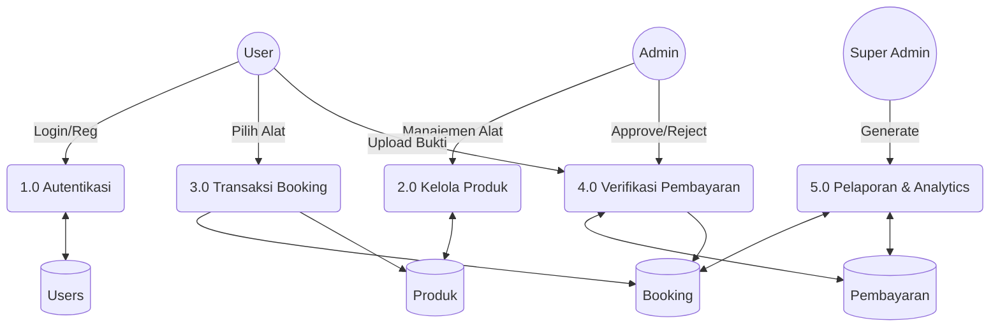
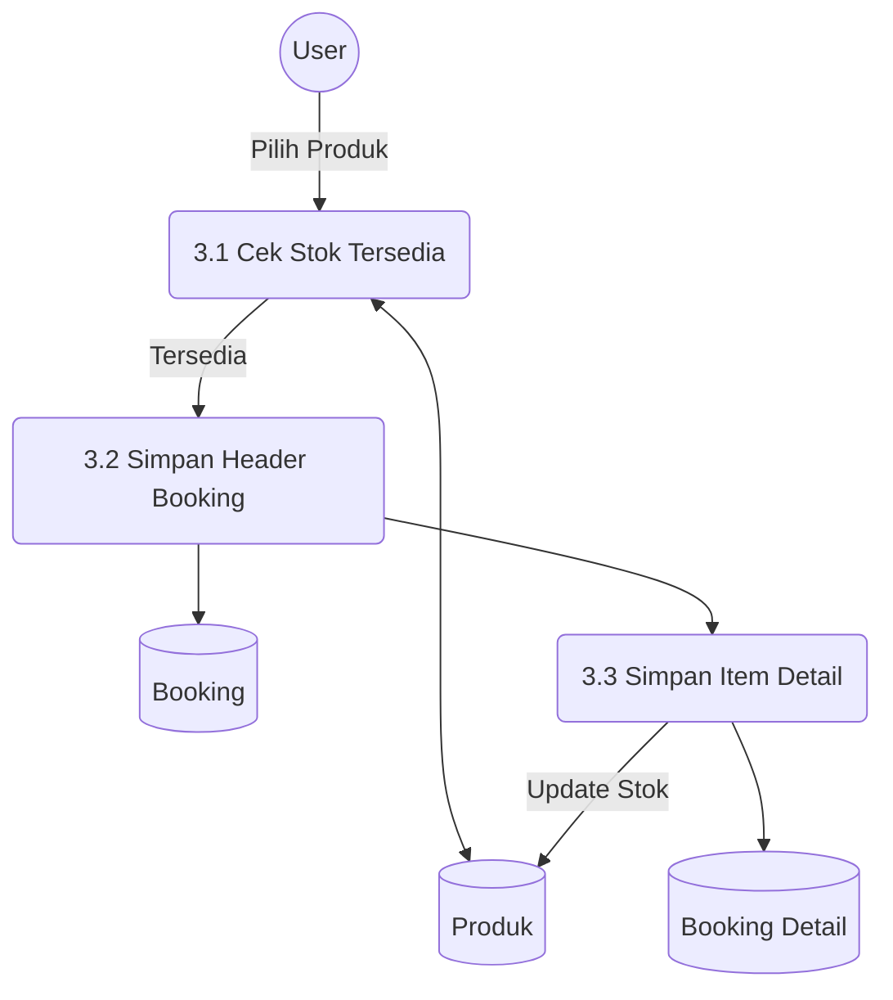
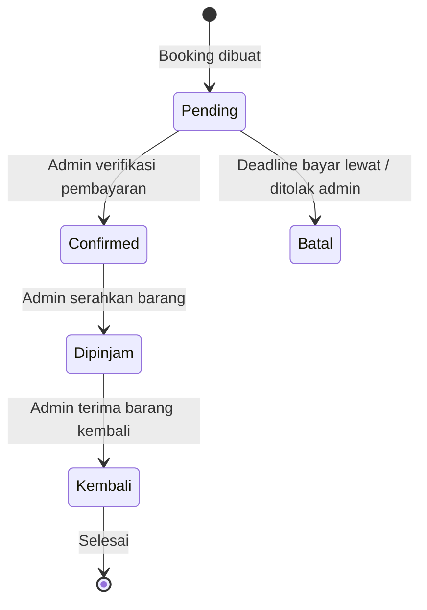
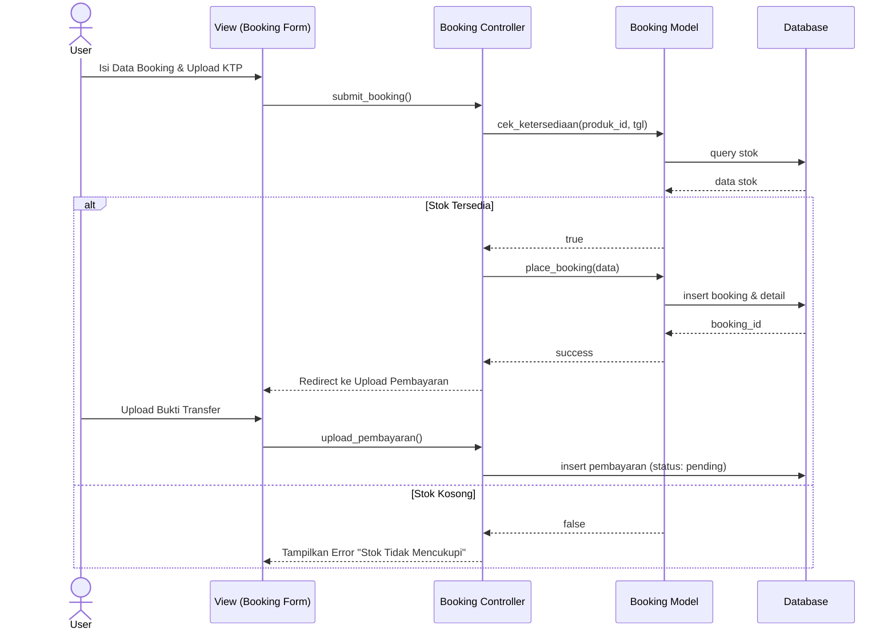
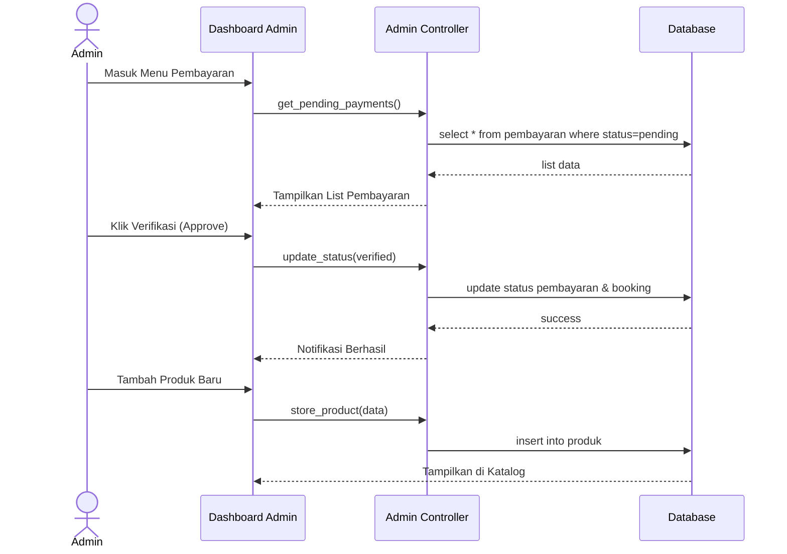
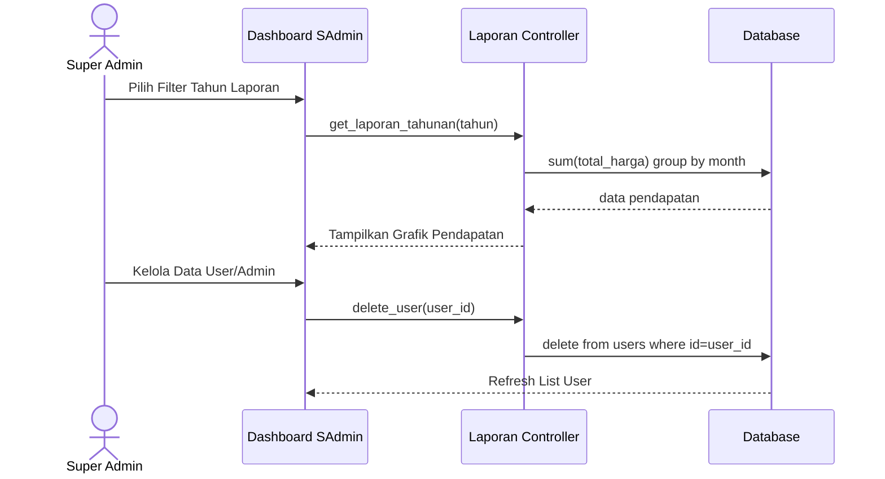
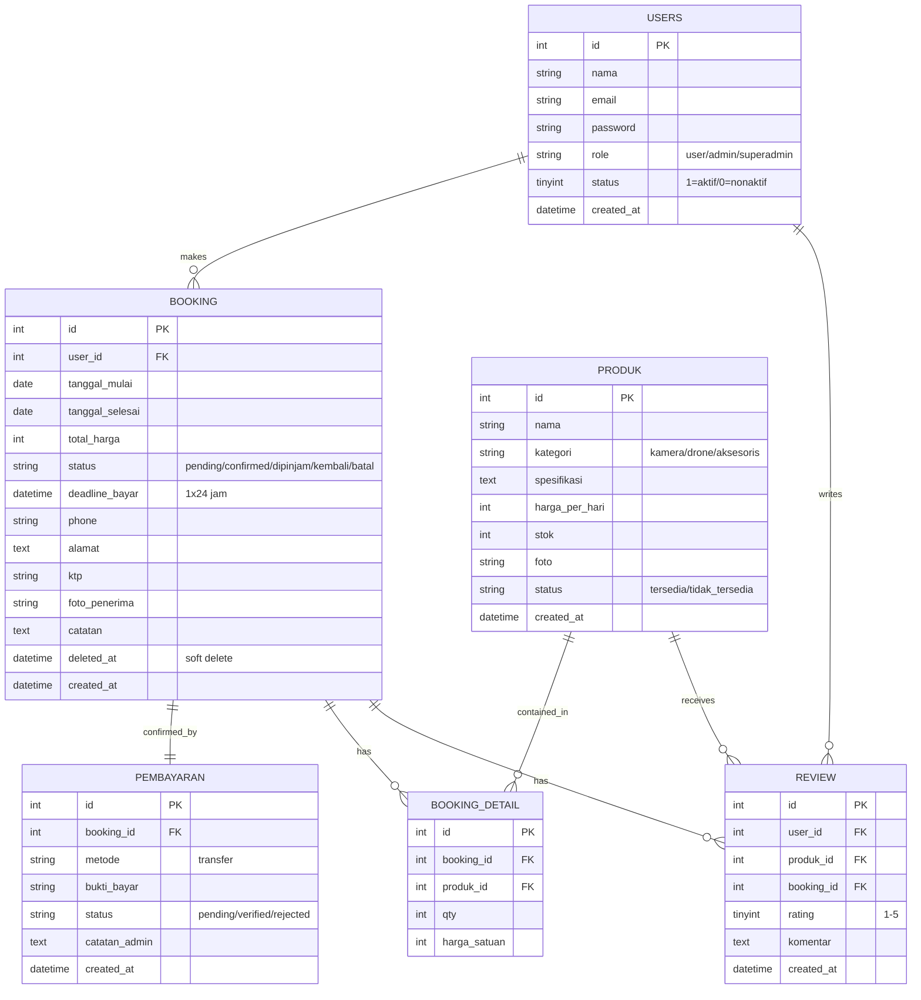

# 📸 RENTCAM — Dokumentasi Arsitektur & Alur Kerja Sistem

Dokumen ini menyediakan panduan teknis mendalam mengenai sistem **RENTCAM**, mencakup alur logika bisnis, diagram aliran data (DFD), dan struktur relasi database (ERD).

---

## 1. 🔄 Flowchart Sistem (Alur Bisnis)
Flowchart ini menggambarkan langkah-langkah yang dilalui oleh pengguna dan admin dalam siklus penyewaan.

---

## 2. 📊 Data Flow Diagram (DFD)

### DFD Level 0 (Context Diagram)
Menggambarkan interaksi antara entitas eksternal dengan sistem RENTCAM secara global.

### DFD Level 1 (Process Diagram)
Memecah sistem menjadi proses-proses utama.

### DFD Level 2 (Detailed Booking Process)
Penjelasan mendalam mengenai proses transaksi booking.

---

## 3. 🔄 State Management (Status Transaksi)

Sistem melacak siklus hidup penyewaan melalui kolom `status` di tabel `booking`:

1.  **Pending**: User sudah isi form, tapi belum bayar/verifikasi. Stok di-*hold* (soft reservation).
2.  **Confirmed**: Admin sudah verifikasi pembayaran. Alat siap diambil.
3.  **Dipinjam**: Alat sedang digunakan oleh penyewa (*In Progress*).
4.  **Kembali**: Alat sudah pulang. Stok kembali bertambah secara otomatis.
5.  **Batal**: Booking hangus (melewati *deadline* bayar 1x24 jam) atau ditolak admin.

---

## 4. 🔄 Sequence Diagrams

### 4.1 Sequence Diagram: User (Proses Booking & Pembayaran)
Menjelaskan urutan interaksi saat user melakukan penyewaan hingga pembayaran.

### 4.2 Sequence Diagram: Admin (Verifikasi & Kelola Produk)
Menjelaskan bagaimana Admin mengelola inventori dan memvalidasi transaksi.

### 4.3 Sequence Diagram: Super Admin (Manajemen Akun & Laporan)
Menjelaskan kontrol otoritas tertinggi dan akses data analitik.

---

## 5. 📝 Penjelasan Teknis Diagram
Struktur database yang menggambarkan hubungan antar tabel di RENTCAM.

---

### Penjelasan DFD
*   **DFD Level 0**: Menunjukkan bahwa sistem menerima input dari User (data booking), Admin (update stok), dan Super Admin (kontrol akun).
*   **DFD Level 1**: Membagi logika sistem menjadi 5 modul besar: Autentikasi, Inventori, Booking, Pembayaran, dan Reporting.
*   **DFD Level 2**: Menekankan pada keamanan stok. Sistem tidak akan memproses booking jika `get_available_stok` dari produk tidak mencukupi pada rentang tanggal yang dipilih.

### Penjelasan ERD
*   **One-to-Many (Users-Booking)**: Satu pengguna dapat melakukan banyak transaksi penyewaan.
*   **One-to-One (Booking-Pembayaran)**: Setiap satu ID Booking hanya memiliki satu catatan pembayaran (bukti transfer).
*   **Master-Detail (Booking-BookingDetail)**: Memungkinkan pengembangan di masa depan jika sistem mendukung satu kali checkout untuk banyak jenis alat sekaligus (saat ini diimplementasikan 1:1 untuk kesederhanaan).
*   **Review Relation**: Review memiliki *unique constraint* pada pasangan `(user_id, produk_id)`, sehingga satu pengguna hanya dapat memberikan **satu ulasan per produk**. Kolom `booking_id` tetap disimpan untuk referensi transaksi, tetapi validasi duplikasi dilakukan di level user-produk.

### 🧹 Kebijakan Manajemen Data (Data Deletion)
Sistem ini menggunakan mekanisme **Soft Delete** untuk menjaga integritas data keuangan:
1. **Soft Delete**: Saat data *Booking* "dihapus" (oleh User di menu Riwayat, atau oleh Admin), data tidak benar-benar dihapus dari database. Kolom `deleted_at` diisi timestamp, dan seluruh query baca difilter dengan `WHERE deleted_at IS NULL`. Data tetap tersimpan utuh untuk keperluan audit dan laporan keuangan.
2. **Physical File Deletion**: Untuk menjaga kapasitas storage, penghapusan data pembayaran dari dashboard Admin akan turut memicu fungsi *unlink()* yang menghapus file gambar bukti transfer dari direktori `/assets/uploads/`. Sama halnya dengan file *foto penerima* saat serah terima.

